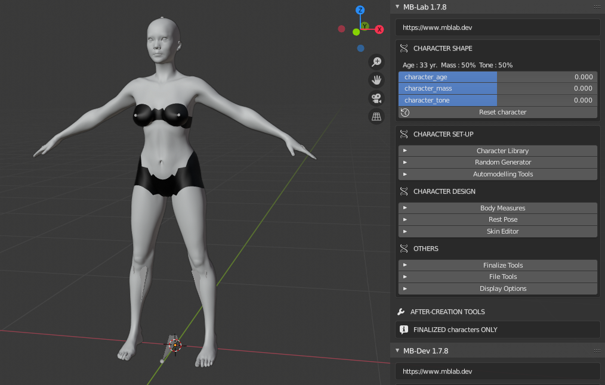
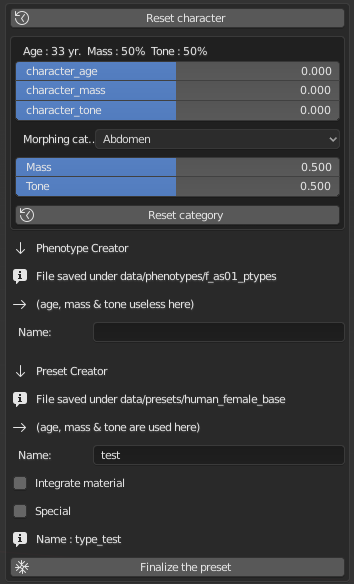
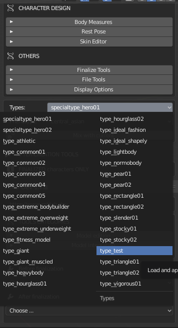

Character Library Creation 
==========================

The Character Library Creation tool is to edit the Phenotypes as well as the character presets of MB-Lab.

Here you can create whole new libraries of characters easily.

=================
Phenotype Creator
=================

The Phenotype Creator tool will allow users and developers alike to create and edit phenotypes.

Phenotypes are created in the base character directories, for example if you edit the Asian Female that Phenotype will only be for that base character.

--------
Workflow
--------

Create a new character. Do not finalize this character!

Edit the Morphing Catagories in the MB-Dev Sub section, just like you would in MB-Lab's Body Measures sub section

.. image:: images/phenotype_creation_01.png

Enter the new name, a button will appear to save this new Phenotype

.. image:: images/save_phenotype_name.png

Click on the button "Finalize the Phenotype", file is saved. If the file name already exists it will give a warning. It will give a warning right after saving but this is normal.

Create a new scene in Blender, create a new character type and the new Phenotype will appear in the characters Phenotype menu

==============
Preset Creator
==============

Presets are types of changes to character models from the **Age, Mass and Tone** values. These are the simplest editing to MB-Lab characters in the MB-Dev toolset.

--------
Workflow
--------

Create a new character. Do not finalize this character!

Editing the Age, Mass or Tone values can be saved as a character preset used by all MB-Lab characters **of that gender**, for example the "human_female_base".

Enter the new name, a button will appear to save this new preset.

Click on the button "Finalize the preset", file is saved. If the file name already exists it will give a warning. It will give a warning right after saving but this is normal.

Create a new scene in Blender, create a new character of the same gender and the new preset will appear in the characters preset menu

There is a checkbox for "Special" types, which is still unclear why they are special.

You can also intergrate the material, such as changes to the skin of the character, for this preset.