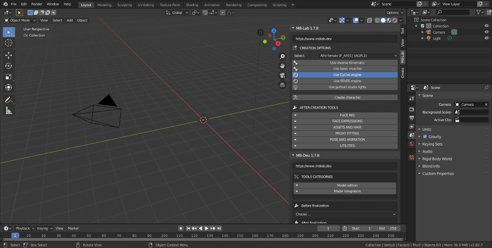
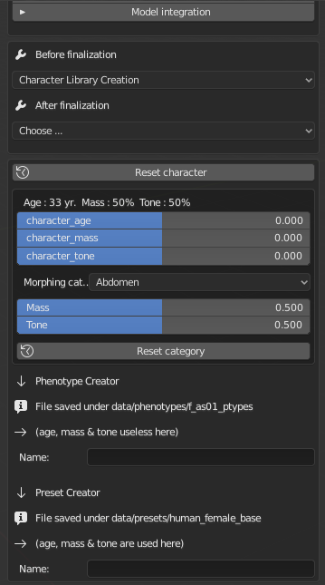
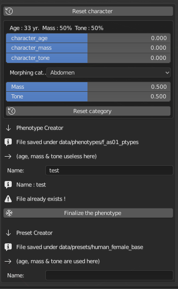

Character Library Creation 
==========================

The Character Library Creation tool is to edit the Phenotypes as well as the character presets of MB-Lab.

Here you can create whole new libraries of characters easily.

=================
Phenotype Creator
=================

The Phenotype Creator tool will allow users and developers alike to create and edit phenotypes.

This is part of the MB-Dev framework tools to develop new models and characters for MB-Lab. At the moment it supports only existing base characters.

--------
Workflow
--------

Create a new character. Do not finalize this character!

Edit the Morphing Catagories in the MB-Dev Sub section, just like you would in MB-Lab's Body Measures sub section

Enter the new name, a button will appear to save this new Phenotype

Click on the button "Finalize the Phenotype", file is saved. If the file name already exists it will give a warning. It will give a warning right after saving but this is normal.

Create a new scene in Blender, create a new character type and the new Phenotype will appear in the characters Phenotype menu

