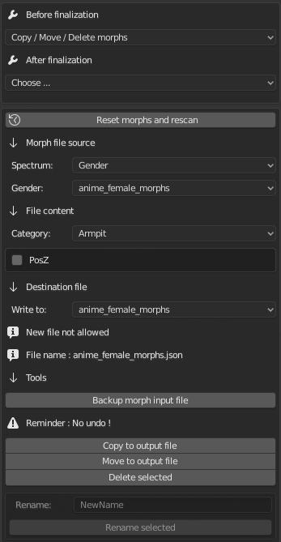

Morph Tools
===========

Copy / Move / Delete Morphs, which allow the user to do some file work with morphs.

When you copy/move morphs from a file to another, if the other file is a new file, it will not show up in drop-down list about input files. You have to quit Blender

When you rename, move or delete morphs, you have to reset/rescan first, then change input file and comeback to your file you're working on. It's not intended, but I didn't figure out how to change that yet. A workaround is to do "new general file" in Blender and create a new character.

If you rename a morph (one each time only), if you reset/rescan, it'll disappear from the items in the category.

It's normal and due to the way Blender works.

Some variables must be created in the beginning of the session, and when the session is started, you can't change them anymore.

All morphs' names are created at this moment and can't be changed after. So new ones created by the tool can't show up for this reason.

For the moment you can't create files for a whole gender. It's intended, as most of morphs inside are essentials for many objects in a model. Groups, bboxes, and so on.

Warnings

**No undo** with this tool. If you're not sure, make backups.

Reminder : There are 2 types of morphs : The simple, and the combined (combination of 2~4 simple ones). When you rename a combined morphs, be aware to rename it in the same way.

Example : "Torso_Mass-Tone" will becomes "Torso_Whatever-YourChoice"

Rename it "Torso_WrongChoice" and engine will have bad behavior.

Also, don't forget that many morphs are essential for the engine, as they are used for other things like groups (used in muscles and measures), bboxes and so on. So use this tool wisely, and if you're not the creator of the base model, use it only when you do user-files management, fix duplicate names from different sources and so on. Don't touch any morphs if it's not necessary. There's a spelling mistake ? It doesn't matter.

