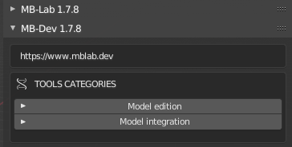

MB-Dev Framework
================

These are a new set of tools that allow the editing of MB-Lab characters.

The tools allow the editing of existing base mesh as well as creating new base mesh data.

The tools are split into two parts.

**Model Edition**

Allows the editing of existing base character models

.. image:: images/mb_dev_178.png

.. toctree::
   :maxdepth: 2
   
   morph_creator
   copy_morphs
   char_lib_creation
   age_mass_tone_creation
   expression_editor

**Model Intergration**

Tools to create the JSON data required for base character models

.. toctree::
   :maxdepth: 2
   
   dev_model_init
   config_files
   measures_file
   morphs_files
   joints_files
   vgroups_files

