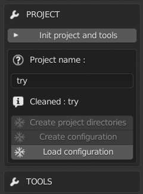
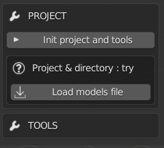
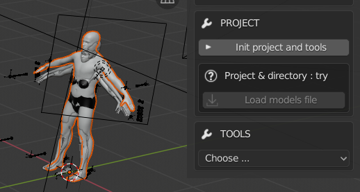
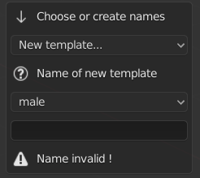
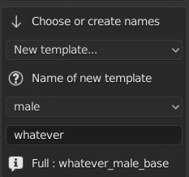
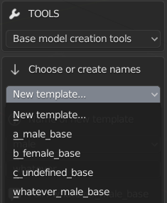
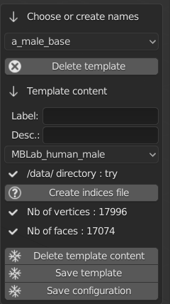
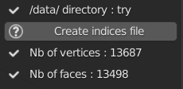
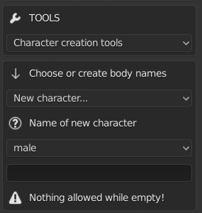
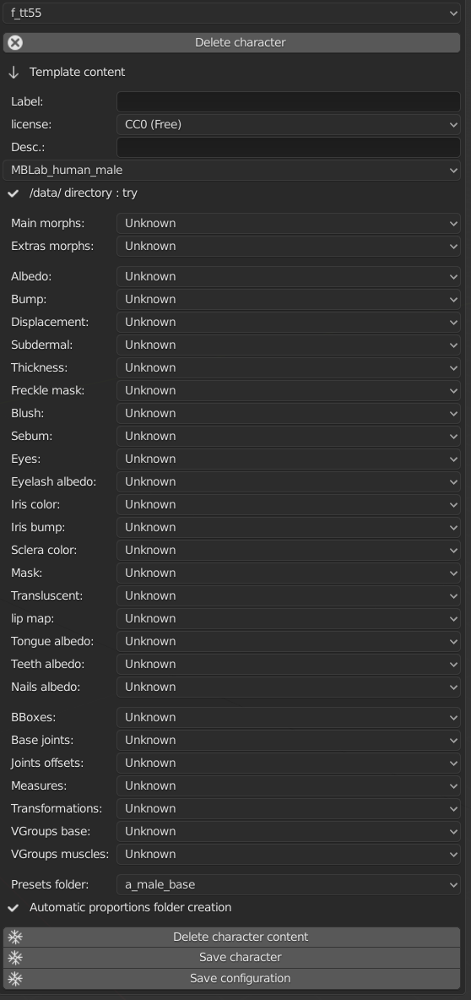

Model Intergration
==================

This part of the MB-Dev tools is to add new characters to the MB-Lab library.

The process is relatively easy with these tools. However care must be taken to do the correct steps.

**Step 1 :**

So now, above tools for create a model from scratch, we have all related to the config file :

1st we can init the project and make a fresh start.

2nd the name of the project (in fact, the name of the /data/ directory where all files for the engine are). From there you can create most of subdirectories. Save the config file or load it (if the name is correct).

Then you can use the tools. What is important to know here is :

You can have more than one model for a single project. Typically, both genders.

The sub-directories that are their name dependent to the model's name are created while using the tools, not when the project is initiated.

A special key is added to the config file and it's the /data/ directory..

On a side note, buttons here are exclusive :

    Create sub-directories can only be clicked if they don't exist (only first one is checked)
    
    Create configuration can't be clicked if the file already exists, so you can click on...
    
    Load configuration instead.
    
    The names for all these actions are automatic, user has nothing to do.

**Step 2 :**

So, the configuration file is loaded. For the moment it's empty.

The first thing to do is to load the model where all base models are stored.

    One blend file is permitted by config file. It must have bodies, skeleton, lights eventually. For this example I took the base project file.
    
    Important : The blend file MUST be named projectName_library.blend, otherwise the button is inactive. And it must be placed in /data/ directory, not in project directory. So here for the example, the name is try_library.blend.

So if you click the button, all objects in the file show up, and you have access to the tools needed to construct config file.

All objects are visible in the collection. And when you change the project, or use MB-Lab as a simple user, the collection and its content are deleted.

**Important notes about the blend with model(s) :**

    It can have all models you want. And other stuff if you want. But the lighter it is, better it is.
    
    However, the mesh you want to use must have the same name of its parent. Example :
    
    .. image:: images/mb_lab_mistake_01.png

    This is not good, because there's a typo, so the names are not the same. It's not allowed.
    
    All skin of the model must be linked, i.e seen by Blender as a single surface. Teeth, eyes, eyebrows are not linked, but all the rest must. This is not good :

    .. image:: images/mb_lab_mistake_02.png

    Head has 3 parts, it should have only one, as the rest of the body.

When models are loaded, the 1st thing to do when the config file is empty, is to name the templates :

    The templates are the base models that MB-Lab uses to make the body types and gender as African male or Asian female. There's no template for the moment, so we create them.
    You choose the name, the gender (undefined is possible). Again, the final name is automatic and has rules, so parts of it can't be changed.

    One template for one base model, no more. You have 5 base models, you can create 5 templates at most.
    Then it's done you can choose the template in the upper drop-down list. If you want to delete it, it's can be done in the next step.

    When you choose a template, a list of information to give appears, that defines completely the base model as a template for later models like African, Polynesian... (next step)

Step 3 :

When models are loaded, the 1st thing to do when the config file is empty, is to name the templates :

The templates are the base models that MB-Lab uses to make the body types and gender as African male or Asian female. There's no template for the moment, so we create them.

You choose the name, the gender (undefined is possible). Again, the final name is automatic and has rules, so parts of it can't be changed.

 
One template for one base model, no more. You have 5 base models, you can create 5 templates at most.

Then it's done you can choose the template in the upper drop-down list. If you want to delete it, it's can be done in the next step.

When you choose a template, a list of information to give appears, that defines completely the base model as a template for later models like African, Polynesian... (next step)

Step 4 : The template

So now that the template is created, there are several information to give.

The main concept to know here is when an information is known, it's displayed as a label with a checkmark icon. Here, for example, without having entered anything, the number of vertices and faces are already knwon because the drop-down list for base model shows 'MBLab_human_male". if we change it by "anime male", the values are changed.

Note : The base model is in a drop-down list. When the content is saved, the list is changed by a simple label.

So the the creator has to give the information.

    A button to delete the template. No undo !

    Label : A short text to present the model. Be short !

    Description : A longer description, that is shown as a tip.

    The model to use that is stored in the blend file. IMPORTANT : One model for one template. If a model is used by a template, it can't be used for another template. NOTE : if your model disappears when you choose it (therefore you can't select it anymore), it's because the name of the mesh is not the same of its parent in collection. And it's case sensitive : "My_Model" is not identical to "my_model".
    
    The directory where all (except config and blend files) is stored, as the morphs, the materials, shaders, and so on. It's the name of the "project". Here it's 'try'.
    
    Tool that creates a list of indices that are always used by body types (as Asian, Caucasian). Here it's just the ID of vertices. The vertices for each body type are stored elsewhere and are without ID. The tool for body types is explained in next steps.
    
    The number of vertices that the model has. The engine checks that later to be sure that it uses the right model. Automatic.
    
    Same for the faces/polygons. Automatic.
    
    After that you have 3 buttons.
    
    Delete content (but not the template).
    
    Save the template. When saved, the UI changes. Example :

    .. image:: images/mb_dev_create_indices_02.png

    Here, there's just the indice file that is not created yet.
    
    Save configuration. The content is saved on file.

Note : When you check the content of all your templates, don't hesitate to click on "save template" for each template you're checking. Because by construction, data that are filled automatically, are not stored in the config automatically. You are sure of that by clicking the button.

When the check is done, don't forget to save the file.

Next step, a tool for doing the same thing (basically) with body types. But be sure that all templates are done before going to the next step.

Step 5 : The character

So now that we created all templates we wanted from the base models in the blend file, we have to create characters from them.

The creator has now to choose "Character creation tools". Then he basically has the same workflow to create his character :

    Starts by creating the name (see below for rules)
    
    Then he chooses the name he just created in the the dropdown list, then he has a bunch of files/folders to choose (next step).

Rules :

    For the name of character, it must be a 4 letters name; like as01, tt55 and so on. Shorter names are valid, but prefer 4 letters.
    
    By convention, the first 2 letters describe the body type : as for Asian, ca for Caucasian and so on. Then there are 2 numbers from 01 to 99 for obvious reason. These are not strict rules, but comply with it is better for clarity.

Step 6 : Character content

Here is the most tedious part of the tool. As you have seen during the previous step, you have a bunch of items to fill in. Especially textures for shaders. Until the engine works another way, you have to fill up all dropdown with texture files stored in their dedicated directory.

So, before talking about the tool itself, few things to know :

    Morphs are their own directory (see documentation about making your own morphs for more details). Textures have their directory too, as joints, BBoxes and so on. Same thing about the 2 folders that have to be filled in. But some files have to be created outside MB-Lab, other don't. Here is the list :

    Files that can be made with MB-Lab tools : Morphs, Measures, Transformations.
    
    Files that have to be created outside MB-Lab : Textures.
    
    Files that have to be created outside, but are transformed with internal tools before using them : BBoxes, Joints, VGroups.
    
    The name of folder must be chosen during this step, and is stored in the config file, but the folder itself is physically created when files inside are created by MB-Lab's tools.

    The fill of this step can be long and tedious. But, as the other tools, it's not necessary to have all files created/known. But if you start a session, and then you decide to change some values, if you click on "delete character content", all values will be deleted and you'll have to fill in all values again.
    
    So, when you don't know a file, or you are sure to change it soon, let the dropdown list to "Unknown". This way, each time you start a new session for this character, you'll be able to choose a file.
    
    The exception for this is when you make changes during the session, for the same character. The dropdown lists keep in memory the last file shown. So if you validate the list, and decide to change it just after, no problem, you won't have to refill everything.

So, what's going on here :

    Label + licence : gives a label shown when using the character. Here (F_AF01) is automatic, you don't have to write it.

    .. image:: images/mb_dev_license.png

    Description : A long description of the character (as a tip for label).
    
    Next, the base body to choose, as for the templates.
    
    /data/ aka the project's directory, is automatic.
    
    Next the files for the morphs. See documentation for the tools for creating morphs for more details. Here are the files for whole gender, aka files that can be used by all characters with the same base model. The files don't have to be created yet. Let "unknown" if necessary. Directory : /data/morphs/
    
    All textures for skin, eyes, nails and so on. Depending of the shader used for rendering, sone of them may not be used. "Unknown" is good for these cases. See documentation about shaders for more details. Directory : /data/textures/
    
    BBoxes : See documentation about the dedicated tool for more details. Directory : /data/bboxes/
    
    Base joints and Joints offsets : See documentation about the dedicated tool for more details. Directory : /data/joints/
    
    Measures : See documentation about the dedicated tool for more details. Directory : /data/measures/
    
    Transformations : See documentation about the dedicated tool for more details. Directory : /data/transformations/
    
    VGroups base and muscles : See documentation about the dedicated tool for more details. Directory : /data/vgroups/
    
    Presets folder : Choose the folder where the presets will be stored. The name is the same as the template. Directory : /data/presets/named_folder/
    
    Proportions folder : Naming is automatic. Directory : /data/anthropometry/named_folder/

Don't forget for each character to "save character" and 'save configuration" when you add/change/check things.

The configuration file is done.

The creator has to do more to be able to use his model in the engine. But it's a good start. Next we'll see tools that transform things done outside MB-Lab but done in Blender (BBoxes, skeleton, ...) and how to import them in the engine.