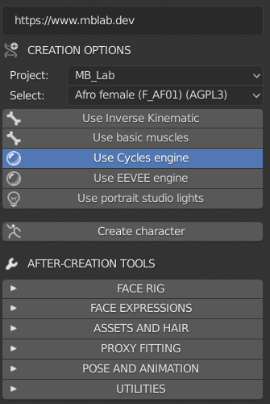
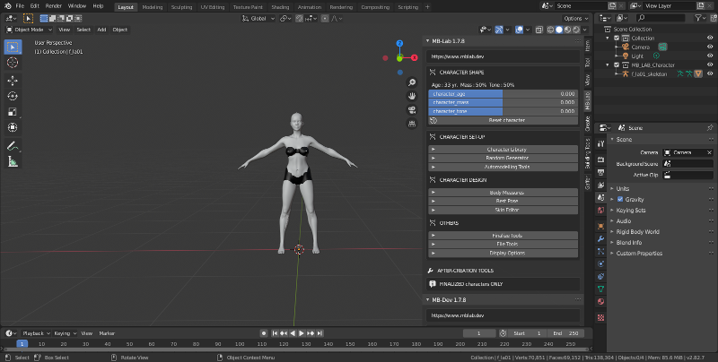

Getting Started
===============

The user interface of MB-Lab is seen in the sidebar of Blender, by pressing N on your keyboard or by expanding the panel with your mouse.

The MB-Lab interface upon startup consists of a few elements :

* A selector to choose the Project
* A selector to choose the base model
* Options to use IK or Muscles
* Options to use EEVEE or Cycles rendering engines
* An option to add lights to the scene
* The create button to initialize it

Step 1

The user has to choose the project he wants to work with. This is a new feature of MB-Lab 1.7.8

Each project has its own models, shaders, morphs and so on.

The meshes are dedicated to their project, as the rest of the stuff.

For example, the models available in standard with this addon are 2 human models, a male and a female, and 2 anime (Japanese style) models, a male and a female.

MB-Lab includes a set of base characters, as shown in the figure:

Pressing the "create character" button, Blender will create the selected model, placing it in the centre of the scene, at coordinates 0,0,0.

MB-Lab was redesigned for Blender 2.80 and above, with shading networks for both Cycles and EEVEE. Choosing either option will select the render engine required.

The option "Use portrait studio lights" creates a set of lights.

.. image:: images/threepoint_arealights_01.png

Note: the scale is one BU (Blender Unit) = one meter.

The system has to import some hundreds of morphings, so it requires some time to complete.

At the end of the process the character will be ready for modification.

.. toctree::
   :maxdepth: 2

   base_char
