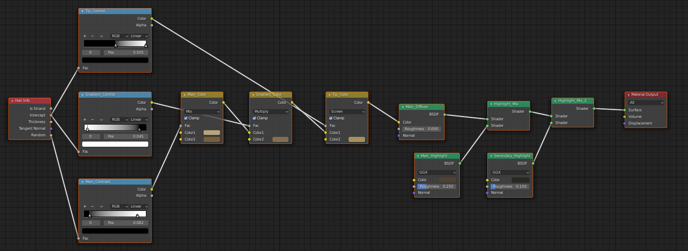

Hair System
===========

The Hair Engines allows the ability to add particle hair to a MB-Lab character after finalization.

.. image:: images/hair_full_render_002.png

The particle hair can be accessed in ASSETS AND HAIR group of MB-Lab.

.. image:: images/GUI_hair_01.png

Features

- Add hair from selected polygons.

This adds the ability to create custom hair objects on virtually any part of the body.

- Add unlimited hair objects.

You can add as many particle Hair systems as you want!

===============
How to add Hair
===============

1. Create and FINALIZE the character model. Adding the Hair Engine only works on FINALIZED models, just like the other assets.

2. Click on ASSETS AND HAIR in the MB-Lab GUI

.. image:: images/hair_tutorial_01.png

3. Click on Particle Hair

.. image:: images/hair_tutorial_02.png

4. Done!

After this you can groom the particle hair as you please, using the standard Blender tools.

====================================
How to add Hair to Selected Polygons
====================================

This is another feature of the Hair Engine that allows you to add particle hair to selected ploygons of a MB-Lab character.

1. In EDIT mode, select the polygons you want to add Hair to

.. image:: images/hair_tut02_selectpoly.png

2. Click on Hair from Selected

.. image:: images/hair_tut02_addselected.png

3. Done!

Again you can groom the hair system using the Blender tools

.. image:: images/hair_tut02_groom.png

Add more Hair!

.. image:: images/hair_tut02_004.png

===========
Hair Shader
===========

Upon creation the Hair Engine will assign a shader.

Depending on what rendering engine you have selected when you create a new character, it will attach either a Principled Hair BDSF for Cycles or a custom hair shader for EEVEE.

The reason for this is because EEVEE cannot render Principled Hair BDSF nodes.

Below are the shader networks seen in Cycles or EEVEE

===========
Hair Guides
===========

This is a very new addition to the MB-Lab hair engines, built by the same developer that has done the previous hair engine.

This engine will add a new scalp mesh very similar to the previous hair engine, however this will give you the option to attach hair guides to this new mesh.

These hair guides can be moved according to your needs.

It also allows you to bake the hair to cards, for use in things like game engines or other rendering software that can't properly render the particle hair.

First add the scalp mesh.

Select the Add Curve Guides then click on the Hair from Vertex Groups button, this adds the curve guides

These curve guides can be moved around for your needs.