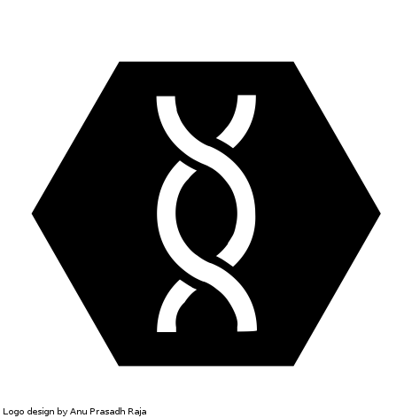

MB-Lab Documentation
====================

MB-Lab is a project aimed to create a powerful 3D humanoid editor, it is based off the popular ManuelBastioniLAB, now a community developed and supported project.

Contents
--------

.. toctree::
   :maxdepth: 2

   about
   requirements
   installation
   getstart
   model_process
   creation_tools
   skin_editor
   finalize
   after_creation_tools
   save_export
   developer_main
   license

