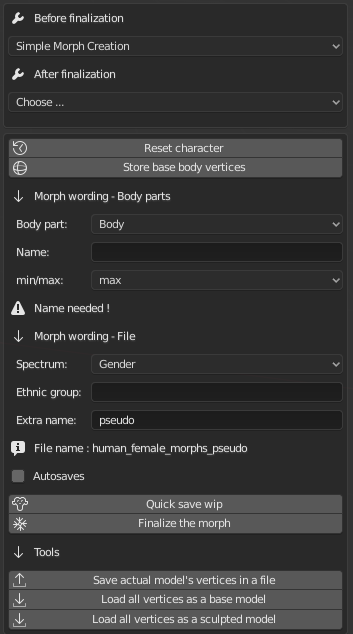

Morph Creator
=============

The new Morph Creator allows users and devlopers alike to create and edit morphs.

This is a development tool, which of it's kind has never been present in MB-Lab, making it a unique addition to the addon.

This document is a WIP.

--------
Workflow
--------

What is the workflow to create morphs to a model ?

First, what is a morph ?

A morph is a group of vectors that move vertices they are attached on. Each morph corresponds to a specific body part, and the name explains what it does. For example Torso-SizeX is a morph that change the size of the torso along the X axis. The first part of the name is the category where the morph is. A same morph can't be in 2 different categories. And each morph has a minimum value(0) and a maximum (1). For the moment we can't exceed theses values.

Different types of morphs ?

For the user, no. They don't exist after finalization, except for the morphs involved in face expressions, they are changed in shapekeys, and used to create expressions like angry, or happy.

For the creator, it's different, you have 2 types.

-------------
Simple Morphs
-------------

They change the size/position/shape of a body part, and they don't overlap other morphs too much (or it doesn't matter, the result fits well in any case).

---------------
Combined morphs
---------------

You see them as simple morphs when you morph a model as an user, but in reality they overlap each over so much that the result would be weird or ugly if they would stay simple morphs. For example, a torso can be fat, athletic, normal, and so on. The tone of the torso has consequences on the mass, etc. So the morphs can't be separated, they must be combined to always work nicely. More about this below.

So, what is the general workflow when creating morphs ?

After the creation of the model, and when all vertices are frozen, you will use mainly 2 editors to create morphs, "Simple Morph Creation" and "Combined Morph Creation".

First thing to do is to choose wisely all the morphs you want to create and try to have a complete list before starting to sculpt.

In this list try to separate the morphs that will stay simple and the ones that will be combined. After a while, changing will be difficult and source of problems.

But, basically, you'll create 2 files for your morphs.

* The main file where you put your simple morphs, and your combined morphs.
* intermediary file where you store the simple morphs that are used to create the combined morphs.

The workflow for creating combined morphs :

You create a dedicated file where you store every simple morphs that you want to use to create combined morphs.

You create/sculpt them and store the results with "Simple Morph Creator" tool.

Quit Blender and reopen it.

Use the "Combined Morph Creator" to choose those morphs (for mix of 2, 3 or 4 simple morphs). Play with min/max values. For each combination you have to sculpt the result and store it. So for combination of 2 simple morphs, you have to create 4 sculpts. For 3 it's 8 and for 4 it's 16. You save the result as a simple morph, it's the same workflow. Important, save the morphs in another file, not the one where the simple morphs are.

When all these combinations are made and saved in the dedicated file, you can either create new combined morphs (and they can re-use simple morphs already used), or delete/move the file where the simple morphs are. Quit Blender, reopen it, and the combined morphs are shown as simple morphs, but their behavior depend of other morphs used for the mix.

**IMPORTANT**

.. warning::
    Do not edit the index/name/number of vertices. NEVER!
    You just can change their location!