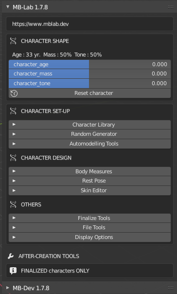
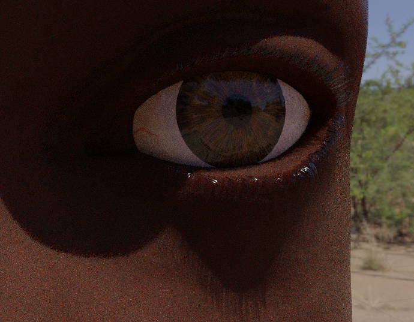
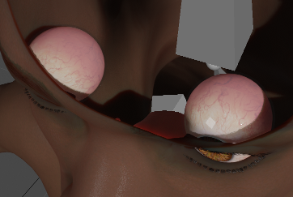
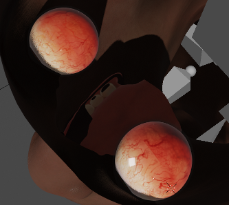

New Features
============

=============
Version 1.8.0
=============

-------------------
Blender 4.0 Support
-------------------

After a long pause of development the next major Blender version is now supported.

Support for Blender 4.0 and 4.1

-----------
Melanin Map
-----------

This version introduces the Melanin Map which varies shades of skin color in various locations on the body.

It should be noted that this map was not scientifically based

---------------------
MB-Lab Skin Shader v3
---------------------

The skin shader has been duplicated from MB-Lab 1.7.6 but with modifications. It was observed that while render time reduction was important, the skin looked less than desirable so the skin shader was reverted back to an acceptable form and modified to showcase the new Melanin map.

The procedural skin bump mapping has been disabled for this version until further notice.

Utilizes the new Principled BSDF shader node for EEVEE.

----------
Scalp Mesh
----------

This was introduced in between MB-Lab 1.7.8 and 1.8.0, adds a new Scalp mesh to the base characters. This will allow for custom hair development.

=============
Version 1.7.8
=============

This version brings a ton of new features and updates!

----------------
MB-Dev Framework
----------------

New framework and tools to edit MB-Lab characters, as well as adopt new models into the MB-Lab library.

.. image:: images/mb_dev_178.png

----------
GUI Update
----------

MB-Lab's GUI was modified. Sliders are now highlighted and the overall look is slimmer and more streamlined.

.. image:: images/mblab_GUI_178_menu01.png

------------
Hair Shaders
------------

The Hair engine now adds shaders to both EEVEE and Cycles

--------------------
Principled BSDF Skin
--------------------

MB-Lab Skin 2 is now using the Principled BDSF Shader Node again. This reduces rendertimes

.. image:: images/comparison_shaders.png

---------------
Eye Lash Shader
---------------

The Eyelash Shader now has gloss and bump

--------------
Eyeball Shader
--------------

The eyeball shader has been updated.

Before

After

-------------------
Texture Map upgrade
-------------------

The texture maps of MB-Lab Skin 2 have been upgraded, this includes 4K bump maps, plus new oil and freckle maps

.. image:: images/4k_bump.png

-------------
Lighting Code
-------------

This is a new code addition that replaces the appending of lights in humanoid_library.blend, uses code to dynamically add lights

.. image:: images/lighting_code.png

=============
Version 1.7.7
=============

This version was improved mainly by contributors in the MB-Lab community!

-----------
Hair Engine
-----------

.. image:: images/hair_render_002.png

The long awaited Hair Engine allows you to add particle hair to finalized MB-Lab characters.

---------------------
Human Rotation Limits
---------------------

Adds rotation limits to MB-Lab armatures (need to be in POSE mode)

.. image:: images/GUI_hum_rotate_01.png

---------------------------
IK and Muscle Systems fixed
---------------------------

.. image:: images/muscle_code_01.png

There were some serious bugs related to the Muscle system of MB-Lab that had gone unnoticed for some time
These have been fixed with this version.

-------------------
Proxy Engine update
-------------------

The Proxy engine has been improved. Fixed fitting of meshes that are very close to the skin. New option to fit in reverse direction to convert a character-specific mesh to a generic proxy.

-------------
GUI updated
-------------

With the new features added the GUI started to get a little crowded, this version has been updated slightly to shrink it down

.. image:: images/GUI_MBLAB177_01.png

=============
Version 1.7.6
=============

This version has several new features!

-----------------
Latino model type
-----------------

This version includes a new Latino model type as well as a new South American phenotype.

.. image:: images/latino_render_01.png

----------
Skin tones
----------

Now skin tones by default will load per model type

.. image:: images/skin_tone_002.png

-------------
MB-Lab Skin 2
-------------

This is a completely new skin shader, using more procedural elements than previous versions, eliminating a lot of texture maps for simple rendering functions (Specular, SSS, Roughness etc...)

.. image:: images/new_skin_shader.png

-----------
Nail shader
-----------

This is a new shader for finger and toe nails with the option to mix between "natural" and "painted".

=============
Version 1.7.5
=============

This version is meant to be the "official" stable version for Blender 2.80 after it is officially released.

----------
GUI change
----------

This version shows the evolution of the GUI that has changed since the original 1.6.1 version.

Icons have been added everywhere now!

.. image:: images/GUI_175.png

-----------------
Improved Face Rig
-----------------

The Face Rig has been updated now, with a new FACS capable Rig

-------------
Tongue Shader
-------------

Now you can edit the skin complexion without changing the color of the tongue.

.. image:: images/tongue_001.png

-----------------------------
Improved Eye and Iris Shaders
-----------------------------

This was a very late addition to MB-Lab 1.7.5 but looks fantastic compared to the previous versions

.. image:: images/new_eyes_04.png

-------------------
Animation BVH Files
-------------------

These are "raw" BVH files of some basic animations such as walking, running, jumping etc...

---------------
BVH Bone Config
---------------

Save and load config files to adjust bones after importing BVH animation files.

.. image:: images/bone_offset_01.png

=============
Version 1.7.4
=============

--------------
Shader updates
--------------

Shaders for this version have been re-worked from the ground up to try to achieve a realistic look as much as possible.

The skin shader has dropped the Principled BSDF node in favor of a new custom node network.

Procedural veins have been added. The visibility of the veins are controlled by a slider in the skin editor.

The eyes have become completely procedural in this version, which allows a greater range of color for the iris than before.

Eye vein visiblity is controlled with a slider.

------------
New Lighting
------------

The lighting setup has been changed to a three point arrangment using Area lights now.

=============
Version 1.7.3
=============

------------
Auto Updater
------------

This version is the addition of the Auto Updater.

.. image:: images/auto_updater_173.png

This will allow users to update to new versions of MB-Lab without having to go to Github or reclone manually.

The updater can auto check at a user defined set interval.

The updater also can make backups of MB-Lab so if by chance a buggy version is released, this can revert back to working version.

The only downside is that the updater works from version 1.7.3 onward so it is not possible to revert back to previous versions, so this makes it a pretty important update as well.
