Skin Editor
===========

MB-Lab provides a custom skin editor that can be used with Cycles or EEVEE.

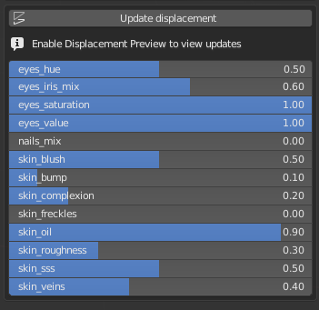

Underneath the Skin Editor are sets of complex surface shaders.

These shaders have been developed to simulate the variety of skin tones and work under any lighting condition. There will be slight differences in the rendering of EEVEE and Cycles but generally try to remain the same.

There are currently two sets of shaders, one "photorealistic" set and the "cell" shaders set. Each set of shaders are assigned to specific base models.

* An advanced human skin shader
* An advanced set of eyeball and iris shaders
* Shaders for the teeth, tongue and nails
* An advanced toon skin shader

The shaders use a combination of texture maps and procedural texture generation, the texture maps are used where procedural generated textures cannot work, while the procedural elements provide details that maps cannot replicate.

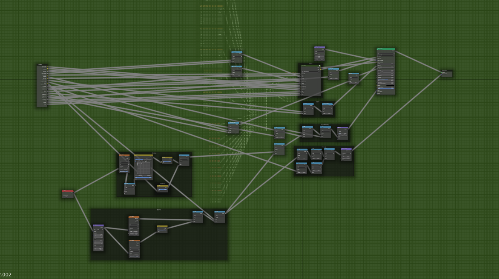

The following parameter editor will change depending on the base model you choose.

The parameters editor is composed by an intuivive set of sliders for easily modify the values of skin complexion, skin bump, skin oil, skin subsurface scattering and more.

These parameters should be adjusted according to your surfacing and lighting needs.

===========================
Realistic Shader Parameters
===========================

The realistic skin shader set are part of the realistic base models.

---------------
Skin Complexion
---------------

This changes the skin complexion shade.

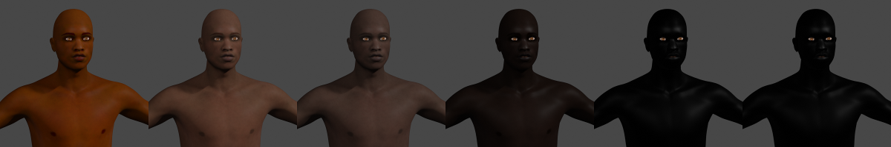

--------
Skin Hue
--------

This changes the Hue of the skin.

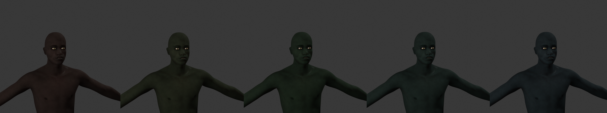

---------------
Skin Saturation
---------------

This controls the amount of Saturation of the skin.

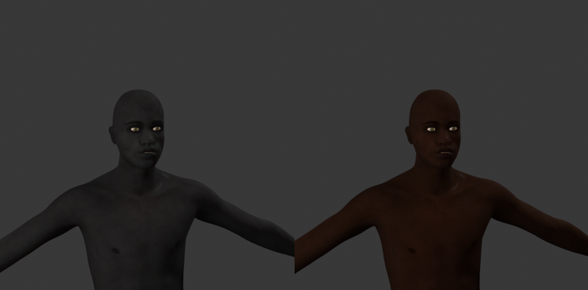

----------
Skin Value
----------

This controls the Value of the skin.

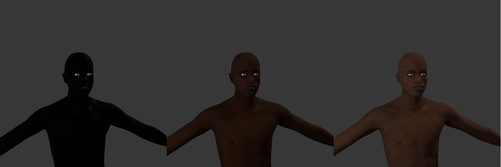

--------
Skin Oil
--------

This provides a subtle effect of oil on the skin.

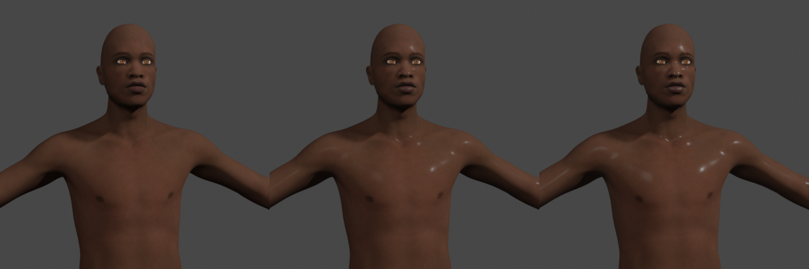

---------
Skin Bump
---------

This parameter controls the amount of the skin bump. It doesn't affect the true displacement of the subdivided mesh, but only the visual bump effect calculated at render time.

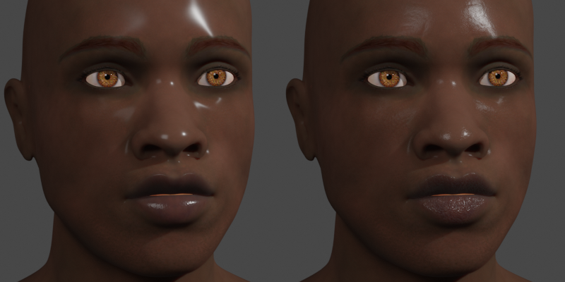

-------------
Skin Freckles
-------------

This parameter controls how much procedural freckles are added, the coverage is affected by a texture mask.

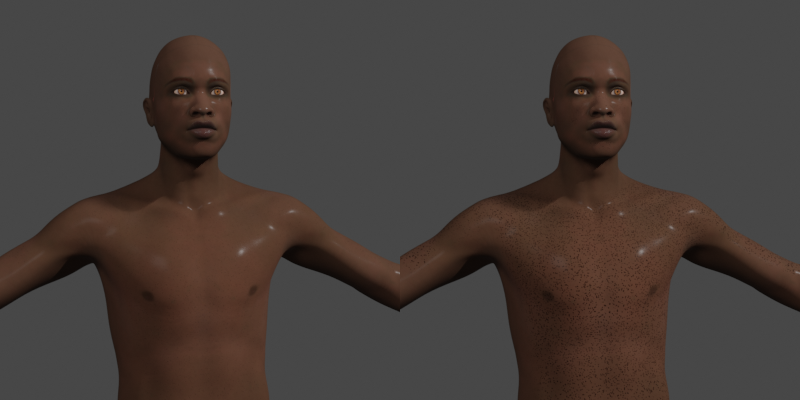

----------
Skin Veins
----------

This controls how much procedural veins are added to the skin.

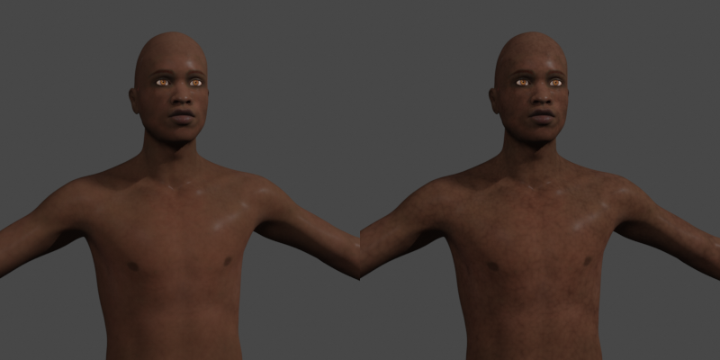

--------
Skin SSS
--------

This controls the amount of SubSurface Scattering.

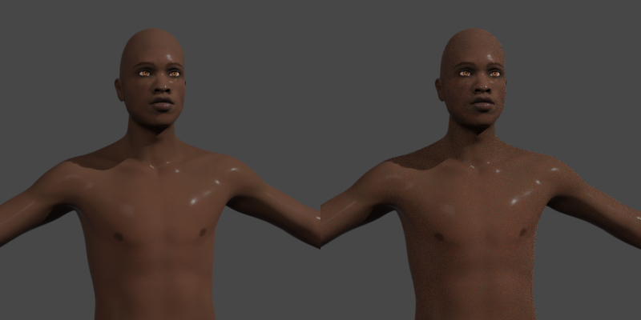

----------
Skin Blush
----------

This controls the level of the blush effect.

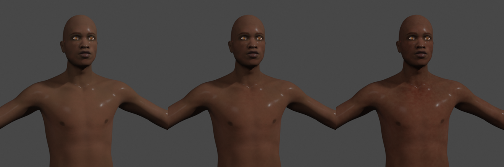

--------------------------
Bump/displacement controls
--------------------------

The button "Update displacement" uses an algorithm to produce a displacement map based on a combination of Age, Mass and Tone.

You should use this button to update the bump/displacement each time you change the meta parameters. Note that to see these changes, "Enable displacement preview" needs to be checked in the Display Options of MB-Lab.

Each time the button "Update displacement" is pressed, the system recalculates the displacement map using the values of meta parameters. This map can be saved with the "Save displacement image" button, in order to be usable in external engines or in finalized characters.

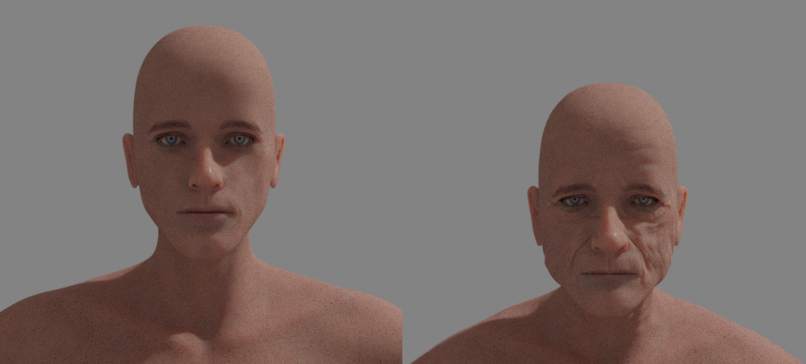

======================
Cell Shader Parameters
======================

The "Cell" shaders have some different sliders for this set.

Be aware that the EEVEE and Cycles rendering will be slightly different due to how the shader works. Also note that this shader is very fast and you will be able to see changes in near real time with EEVEE as well as Cycles.

-------------
Skin Oil Size
-------------

This controls the "oil" size of the cell shader, this effect can bring out the contour of the characters.

.. image:: images/SS_celloilsize_025.png
.. image:: images/SS_celloilsize_085.png

---------------
Skin Oil Value
---------------

This controls the brightness of the "oil", this is used in combination with Skin Oil Size.

.. image:: images/SS_celloilvalue_025.png
.. image:: images/SS_celloilvalue_100.png

-----------------
Skin Outline Size
-----------------

This controls the thickness of the outline of the characters.

.. image:: images/SS_outlinesize_085.png
.. image:: images/SS_outlinesize_098.png

------------------
Skin Outline Value
------------------

This controls how dark the outline will be.

.. image:: images/SS_outlinevalue_000.png
.. image:: images/SS_outlinevalue_100.png

-------------------
Skin Secondary Size
-------------------

This will add another shade to the cell shader, showing even more contour. **This effect is only seen in Cycles currently**

.. image:: images/SS_cellsecsize_025.png
.. image:: images/SS_cellsecsize_100.png

--------------------
Skin Secondary Value
--------------------

This changes the color value of the Secondary cell shading. **Note this is only present in Cycles**

.. image:: images/SS_cellsecval_010.png
.. image:: images/SS_cellsecval_100.png

--------
Eyes Hue
--------

This changes the color hue of the iris in the cell shader.

---------------
Eyes Reflection
---------------

Controls how much fake reflection is shown on the eyes.

---------------
Eyes Saturation
---------------

This controls the Saturation.

----------
Eyes Value
----------

This controls the value, or lightness, of the iris.

===========
Iris Shader
===========

Recently the Iris shader has been updated to remove the image based shader and now use a fully procedural network.

Be warned that the shader can take some time to compile for EEVEE.

--------
Eyes Hue
--------

This changes the color hue of the iris.

---------------
Eyes Saturation
---------------

This controls the saturation of the iris.

----------
Eyes Value
----------

This controls the value, or lightness, of the iris.

============
Texture Maps
============

There are several texture maps for MB-Lab that provide certain effects to the shaders.

As with the shaders there are two sets of maps, one for the realistic characters and the other for the anime characters. The "Realistic" set has quite a collection for the various shader effects, while the "Anime" set consists of at this time a single albedo map.

There is also the ability to change these maps, there are several ways to do this. One option is to use MB-Lab to import or export texture maps.

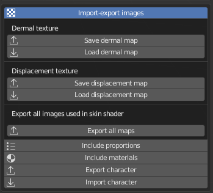

Currently there are only options to export the Albedo map and the Displacement Map (note : for the Anime models there is no Displacement map, so there is not an option to export it), or Export all maps at once.

There is also the option to directly change these maps via the Node Editor for the shader you are editing. This is for instance, one of the ways that new maps have been developed, by replacing a shipped texture map with a WIP one.

=======================
Post Finalization Notes
=======================

Once you finalize the MB-Lab character it is NOT required to have the surface shaders currently shipped with, if your production needs differ from the shaders assigned it is fully possible to add your own shaders.

Each base model has shaders assigned to polygons, these shaders can easily be replaced with your own simply by replacing the current ones shipped.

This also applies to the texture maps that are shipped with MB-Lab, these can be edited by your prefered image editor (such as Photoshop or GIMP) to your specfic needs.