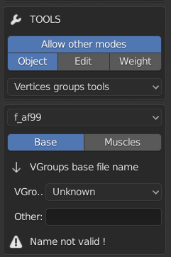
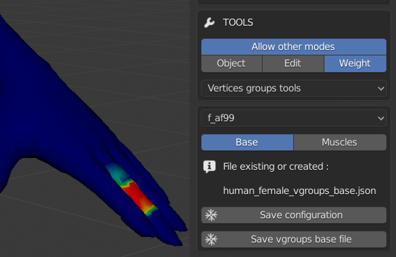
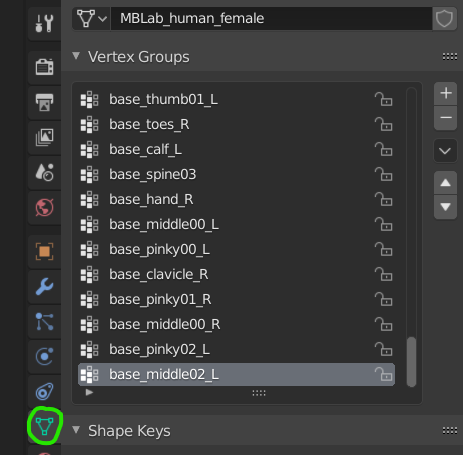
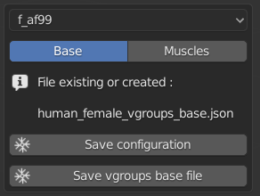
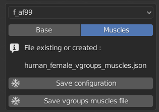

VGroups
=======

Now that the bones and joints are done, you have to apply weights on them, in order to have proper deformations in animation. This is done by vgroups, which keep the weight of each vertex in the group.

There are two types of vgroups :

* For bones, named name_vgroups_base
* For muscles, named name_vgroups_muscles
* They are all available in /data/vgroups/ folder. Each type has its dedicated file.

As the previous tool, creator can't do what he wants, and there are guidelines to create vgroups. The main one are the names, that must fit the names given to the skeleton (and joints).

This tool has a slightly different approach, as the creator will actually use Blender to create the weights, then after the work is done, save the file with the MB-Lab tool.

What is the workflow ?

First, allow to use other modes, then choose "Vertices groups tools"

Then he has a drop-down to choose the character, and if it's for base or muscles.

The workflow to create or assign a file is the same as for previous tools. It's important to note here that creator must use this tool before create or change weight-paint of the character.

When the file is created and assigned, the creator can go to weight mode.

The name of vgroups is available under "Object data properties" Blender tab (along shapekeys)

You can see that each name starts with base _ (or mscl _). That corresponds to the types of vgroups, one for base bones, one for muscles. It's because same names can be used for base and muscles. They are created automatically, and deleted when they are saved on file.

Now the creator can do his stuff, then when he has finished he can save his work. There's one button for each type.
    

    

